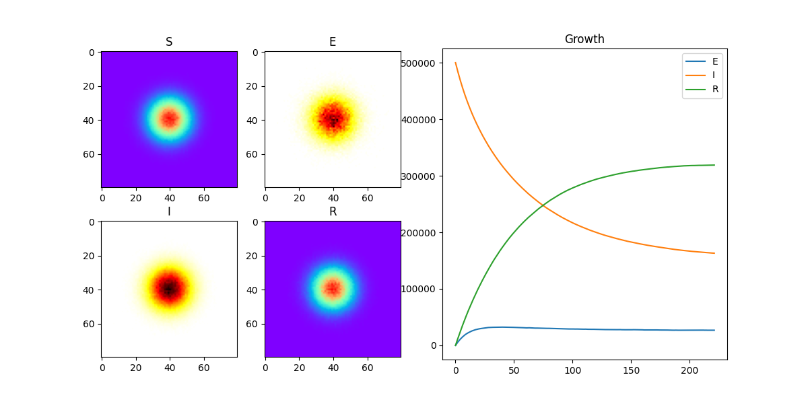
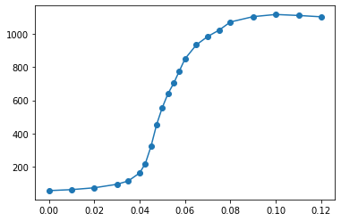

# 基于 SEIR 模型的传染病模拟分析

*少年班学院 马天开 PB21000030*

## 科学技术原理

*SEIR*模型是一种基本的传染病模型，其在*SIR*模型基础上发展得到。它将传染过程分为了如下几个阶段：

-   S，susceptible，即易感人群，存在感染风险
-   E，exposed，即携带者，体内存在病毒，但并不具有传染性。经过一段时间后会变为感染者。
-   I，infected，即感染者，具有传染性。存在治愈率和致死率。
-   R，recovered，即恢复者，已经治愈，在*SEIR*模型中，假定免疫是不会消失的（即不会重新变为易感人群）。


在这个模型中，出于方便考虑可以做如下假设：

-   自然出生率$\mathbb \Lambda$与死亡率$N\mu$相同（意为总人口$N = S + E + I + R$保持不变，但依然假定死亡率存在）
-   从被感染到发病存在一个间隔，参数表示为$a\ days^{-1}$（意为平均发病间隔时间为$a ^{-1} days$）

由以上内容，可以导出这个模型的一般方程：

$$
\left\{
\begin{aligned}
\dfrac {dS} {dt} & = \mu N - \mu S - \dfrac {\beta IS }{N} \\
\dfrac {dE} {dt} & = \dfrac {\beta IS} {N} - (\mu + a)E \\
\dfrac {dI} {dt} & = aE -(\gamma + \mu)I \\
\dfrac {dR} {dt} & = \gamma I - \mu R \\
\end{aligned}
\right.
$$

在此基础上改进的模型还包括：_SEIRS_、_MSEIR_、*MSEIRS*等，其中*M*群体的引入是考虑到部分传染病在婴儿身上天然免疫的情况，而*SEIRS*退化的引入则是考虑到部分传染病存在免疫的时效性，康复人群有概率消失掉已经获得的免疫。

针对绝大部分传染病，上述两种情况对结果的影响都足够小，可以忽略。值得注意的是，以上探讨的数学模型，虽然能很好地拟合现有数据，但却没有讨论人群流动对于传播速度的影响。具体来说，是流动对于$\alpha$值的改变，在这里我们给出一个最直观的表述。

本程序通过一种简单网格状的模拟，希望给出流动对于传播速率的影响的一个简单分析。



在程序运行时，可以逐步观看传播的过程和右侧曲线变化，在模拟量足够大时，右侧曲线与模型一般方程推导的结论完全一致。

然而，当我们改变*emulation_move_speed*的值时，既调整人口流动速度时，我们会发现，右侧曲线出现了较大的偏移。


为了准确的刻画这种流动速度对传播结果带来的影响，我们引入一个评估的参考值：_round_，既使得$I$减半所需要花费的模拟周期数。

根据模拟计算，可以得到如下$round-speed$关系：



可以看到，随着流动速度逐渐增大，流动速度对传播速度的增益逐渐放缓，在模拟的终点甚至有略微下降的趋势，在流动速度的起始位置有着最佳收益点。

## 设计方案

本项目利用了*NumPy*和*matplotlib*作为基础，利用模拟的办法计算传播过程。

参考一篇文献中给出的参数，将系数初始值设定为：

$$
\left\{
\begin{aligned}
\alpha & = 0.62\times 10^{-7} \\
\beta & = 1 / 14 \ days ^{-1} \\
\sigma & = 0.000667 \\
\mu_i & = 7.344\times 10^{-7} \\
\end{aligned}
\right.
$$

### 数据结构和初始化

为方便处理，以及考虑到模拟需要，将数据存储为一个$(4*size*size)$的*np.array*其中$axis=0$分别代表$S,E,I,R$的分布情况，*size*为模拟的单元格数量。

在初始化时，考虑到人口的分布一般是集中的，因此采用了正态分布的方式进行模拟，在初始条件上，设定$I = S/2$来更快地得到模拟结果。

### *Move*函数

*Move*函数主要负责模拟人群的流动，实现方式如下：

如果只考虑相邻单元格间人口的流动，可以采取以下方法：使用*np.random.normal*生成一个$(4*4*size*size)$的矩阵，分别代表各个方向迁移的人口占比，每个数据均限制在$[0,0.25)$之间。然后通过*np.roll*的方式偏移矩阵，叠加最终的结果到原始矩阵上。

### *Spread*函数

*Spread*函数负责模拟各单元格内的传播，通过模拟单个周期内传播的人数来实现。

值得注意的是，按照传播模型计算的人数，是浮点数，并不符合模拟的要求。为此，编写了一个*randFloatToInt*函数，将浮点数转化为整数，同时保留了统计意义上的期望值。

## 创新性表述

本文中提到的所有代码均为本人独立完成，在数据上借鉴了一篇相关的期刊，其余内容均为代码模拟得到。

创新点：

-   在原传播模型的基础上，通过模拟的方法，讨论了流动对传播的影响。
-   通过图表的方式，直观的展现了疫情传播的过程。
-   通过对流动和传播结果之间的关系的讨论，具有一定的社会意义。

## 运行方法和参数设置

可以直接运行*main.py*得到，在打开的命令窗口中敲击回车来模拟一轮计算。

同时，可以通过修改代码的方式得到想要的运行结果，例如可以通过调整`while not reached:`为`for i in range(1000)`来直接模拟运行 100 次后的结果。

参数设置方面，本程序系模拟程序，全部参数放在了代码的起始位置并可调，具体解释如下：

-   $size$，模拟单元格的数量，应该和人数保持对应关系
-   $emulation\ p\ size$，模拟的人数，如遇性能问题应该适当降低
-   $emulation\ scale$，人口的正态分布方差，越小人口分布越密集
-   $emulation\ move\ speed$，人口的流动速度，越大流动越快
-   $emulation\ initial\ infected$，初始的感染人数
-   $rate$，模拟周期的倍率，可以适当调大来满足性能要求
-   $value\ mu$，自然死亡率
-   $value\ alpha$，传播率
-   $value\ beta$，潜伏期的倒数
-   $value\ sigma$，治愈率
-   $value\ mu\  i$，病死率

## 学习心得和收获

经过本次课程的学习，更加熟练了有关*Python*有关科学计算的包的应用和处理方式。对于各种*IDE*的测试、*matplotlib*等有了更进一步的掌握。

在本次课程之前，我对*Python*一直处在一个自己摸索、时常碰壁的学习路上。在最开始使用的时候更为严重，平均下来写代码和排查错误的时间大概要对半分。也不能很好地利用报错信息来排查错误，导致我最开始使用*Python*的体验相当不好，甚至我一度怀疑这样一门语言对效率的提升究竟有多大。

在本次课程之后，尤其是从课程一开始我就在搞的这个项目，逐渐锻炼了我排查错误、调试以及熟练查文档的能力。现在能达到几乎写 *C++*效率的 3 倍左右，可以说真正地把 _Python_ 当作一个有趣的工具来使用，也希望它能在日后的学习/工作中更大地发挥作用。

具体一点讲的话，在本次项目中收获最大的应该要数 _Anaconda_ 和 _Pycharm_ 的使用了。有趣的工具总是能带来更有趣的体验。熟练使用之后，会比单纯使用 *VSCode* 的体验和速度更上一层楼。

## 参考文献

```txt
Suwardi Annas, Muh. Isbar Pratama, Muh. Rifandi, Wahidah Sanusi, Syafruddin Side, Stability analysis and numerical simulation of SEIR model for pandemic COVID-19 spread in Indonesia, Chaos, Solitons \& Fractals, Volume 139, 2020, 110072, ISSN 0960-0779
```
